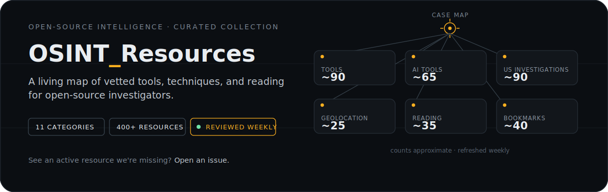
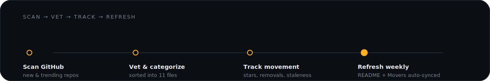

  

  
  
  

A curated collection of OSINT tools, resources, and references, organized by category and reviewed on a weekly cycle. Nothing here is a static list — dead links get pruned, star growth gets tracked, and new finds get slotted into the right file. If you know of an active resource that isn't listed here, [open an issue](https://github.com/mathewrtaylor/OSINT_Resources/issues).

---

  

<!-- MOVERS_START -->
Repositories with the highest star gain over the last 30 days.

| Rank | Repository | Star Gain | Total Stars |
|------|-----------|-----------|-------------|
| 1 | [worldmonitor](https://github.com/koala73/worldmonitor) | +5893 ★ | 61,367 |
| 2 | [maigret](https://github.com/soxoj/maigret) | +3702 ★ | 34,922 |
| 3 | [osiris](https://github.com/simplifaisoul/osiris) | +2232 ★ | 6,433 |
| 4 | [awesome-osint-arsenal](https://github.com/rawfilejson/awesome-osint-arsenal) | +680 ★ | 1,168 |
| 5 | [robin](https://github.com/apurvsinghgautam/robin) | +478 ★ | 5,797 |
| 6 | [OpenOSINT](https://github.com/OpenOSINT/OpenOSINT) | +461 ★ | 906 |
| 7 | [user-scanner](https://github.com/kaifcodec/user-scanner) | +435 ★ | 2,542 |
| 8 | [spyder-osint](https://github.com/tq17oa7/spyder-osint) | +399 ★ | 622 |
| 9 | [Osintgram](https://github.com/Datalux/Osintgram) | +346 ★ | 13,388 |
| 10 | [Claude-OSINT](https://github.com/elementalsouls/Claude-OSINT) | +284 ★ | 1,894 |
<!-- MOVERS_END -->

---

  

_Counts are an approximate snapshot — refreshed weekly._

### `01` Tools & Platforms

| Category | Resources | What's inside |
|---|---|---|
|  [Tools](./Tools.md) | ~90 | Single-purpose OSINT tools — username lookups, email investigation, social media recon |
|  [Tool Sets](./Tool_Sets.md) | ~35 | Multi-function platforms and frameworks that bundle several investigative capabilities |
|  [AI Tools](./AI_Tools.md) | ~65 | AI/ML-integrated OSINT workflows — automated gathering, dark web monitoring, AI-assisted recon |

### `02` Techniques & Investigation Types

| Category | Resources | What's inside |
|---|---|---|
|  [Geolocation](./Geolocation.md) | ~25 | Satellite imagery, live mapping layers, geographic tracking, region-specific guides |
|  [Image Tools](./Image.md) | ~10 | Image forensics, metadata extraction, reverse image search, depixelization |
|  [Sock Tools](./Sock_Tools.md) | ~20 | Sock puppet creation, detection methodologies, blogs, and training content |
|  [US Investigations](./United_States_Investigations.md) | ~90 | State-by-state business entity lookups, Secretary of State searches, public records |

### `03` Learning & Reference

| Category | Resources | What's inside |
|---|---|---|
|  [Recommended Reading](./Recommended_Reading.md) | ~35 | Blogs, training videos, GitHub tutorials, and OSINT learning content |
|  [Library](./Library.md) | 12 | Book recommendations with author, publication details, and investigator-focused summaries |

### `04` Collections & Archives

| Category | Resources | What's inside |
|---|---|---|
|  [Bookmarks](./Bookmarks.md) | ~40 | Curated OSINT repo lists, framework collections, community-maintained hubs |
|  [Case Studies](./Case_Studies.md) | ~15 | Real and fictional investigation case studies for learning technique and methodology |

### `05` Maintenance

| Category | What's inside |
|---|---|
|  [Removed](./Removed.md) | Auto-generated log of repositories deleted or made private on GitHub |
|  [Unmaintained](./Unmaintained.md) | Auto-generated log of repositories untouched for 6+ months |

---

## How this list stays current

  

Every resource in the categories above has been reviewed for activity. Repositories that go dark move to [Removed](./Removed.md) or [Unmaintained](./Unmaintained.md) instead of staying in the main lists as broken promises.

---

## License

Released under the [MIT License](./LICENSE).
